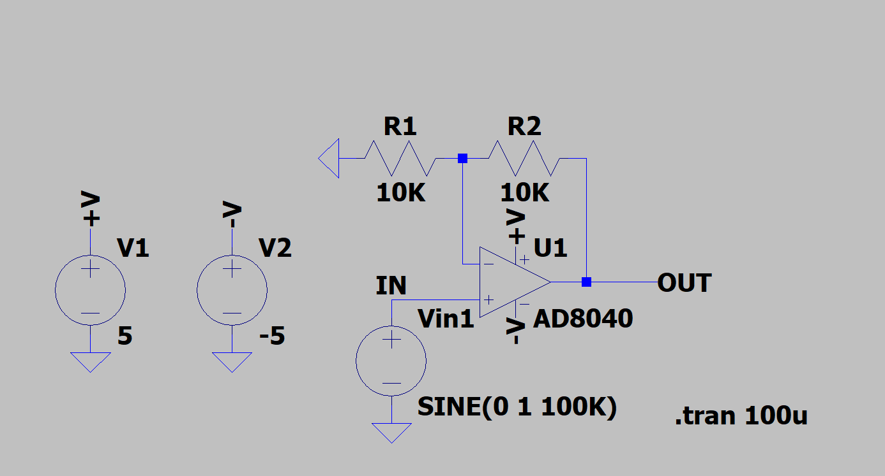
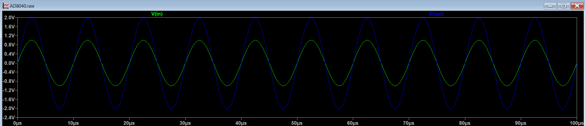

# SPICE_OPAMP_Simulation# LTspice Op-Amp Circuit Analysis

This repository contains schematic and simulation files for an op-amp circuit.

**Primary Finding:** The files provided show a significant discrepancy. The schematic file (`Opamp.PNG`) does not match the simulation results shown in the waveform files. The analysis below breaks down each file and the discrepancy.

---

## 1. The Schematic (`Opamp.PNG`)

### Circuit Configuration
* **Type:** Inverting Amplifier
* **Op-Amp:** AD8040
* **Input Resistor (R1):** $10 \text{ k}\Omega$
* **Feedback Resistor (R2):** $10 \text{ k}\Omega$
* **Input Signal:** `SINE(0 1 100K)` (0V offset, 1V amplitude, 100kHz frequency)

### Theoretical Performance
For a standard inverting amplifier, the voltage gain ($A_v$) is calculated as:

$$
A_v = - \frac{R_2}{R_1}
$$

Substituting the component values:

$$
A_v = - \frac{10 \text{ k}\Omega}{10 \text{ k}\Omega} = \mathbf{-1}
$$

**Expected Result:** A transient analysis of *this* circuit should show an output sine wave that is:
1.  **Inverted:** $180^\circ$ out of phase with the input.
2.  **Same Amplitude:** A gain of -1 means the 1V input amplitude results in a 1V output amplitude.

---

## 2. The Transient Analysis Waveform (`Trans_analysis.PNG`)

### Observed Performance
This plot shows the input and output voltages versus time.

* **Input (V(in), green):** A sine wave with a $\mathbf{1.0V}$ peak amplitude.
* **Output (V(out), blue):** A sine wave with a $\mathbf{2.0V}$ peak amplitude.
* **Gain ($A_v$):** The observed gain is $A_v = \frac{V_{\text{out}}}{V_{\text{in}}} = \frac{2.0\text{V}}{1.0\text{V}} = \mathbf{+2}$.
* **Phase Shift:** The input and output waves are perfectly aligned (in-phase), indicating a $\mathbf{0^\circ}$ phase shift.

### Mismatch
This result (**Gain = +2, Phase = 0°**) directly contradicts the schematic's theoretical performance (**Gain = -1, Phase = 180°**).

This waveform is the correct result for a **Non-Inverting Amplifier** wired with the same resistors, which has a gain of:
$$
A_v = 1 + \frac{R_2}{R_1} = 1 + \frac{10 \text{ k}\Omega}{10 \text{ k}\Omega} = \mathbf{+2}
$$

---

## 3. The AC Analysis Waveforms (`Waveform1.PNG`, `Waveform2.PNG`)

### Observed Performance
These plots show the results of an AC sweep, which measures the circuit's response across a range of frequencies.

* **Window Title:** The raw file is named "2ndOrderBandpass.raw".
* **Magnitude Plot:** The plot shows a sharp peak at **1 kHz** with a gain of **0 dB**. Frequencies above and below 1 kHz are attenuated (rolled off).
* **Phase Plot:** The phase shifts from $+90^\circ$ to $-90^\circ$, passing through **$0^\circ$** at the 1 kHz peak.

## Conclusion

The files in this project appear to be from **three different, unrelated circuits:**

1.  **`Opamp.PNG`:** A schematic for an **Inverting Amplifier** (Gain = -1).
2.  **`Trans_analysis.PNG`:** A transient simulation result for a **Non-Inverting Amplifier** (Gain = +2).
3.  **`Waveform1.PNG` / `Waveform2.PNG`:** An AC simulation result for a **2nd-Order Bandpass Filter** (Peak Gain = 0dB @ 1kHz).

To have a consistent project, the schematic file (`.asc` in LTspice) must be correctly simulated to generate the matching waveform files (`.raw`).
